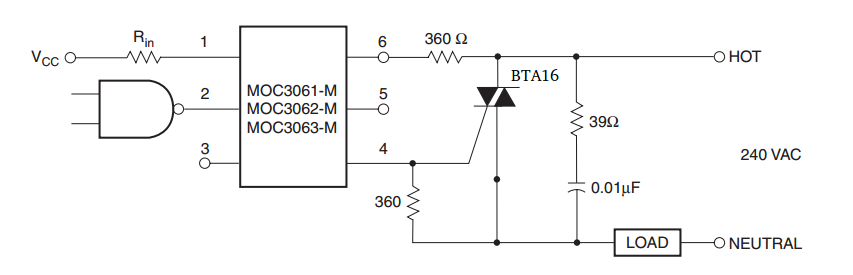
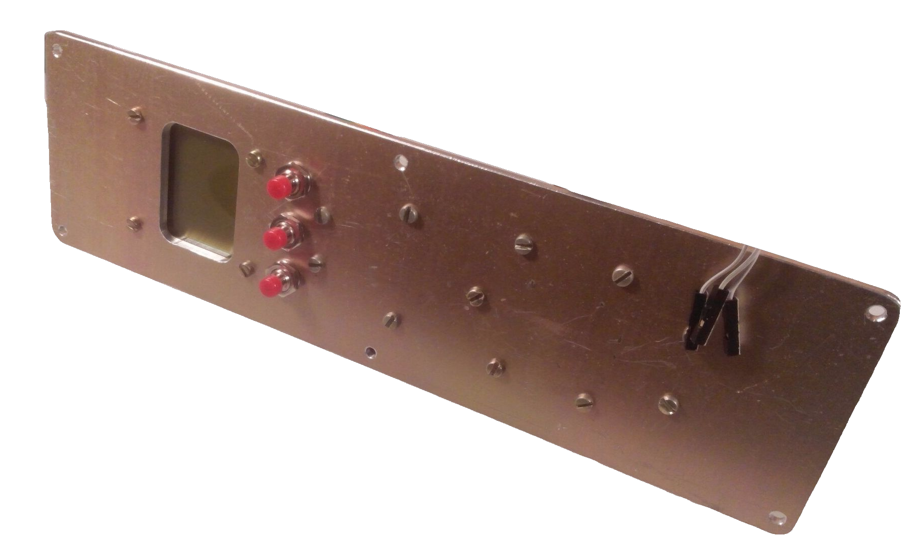
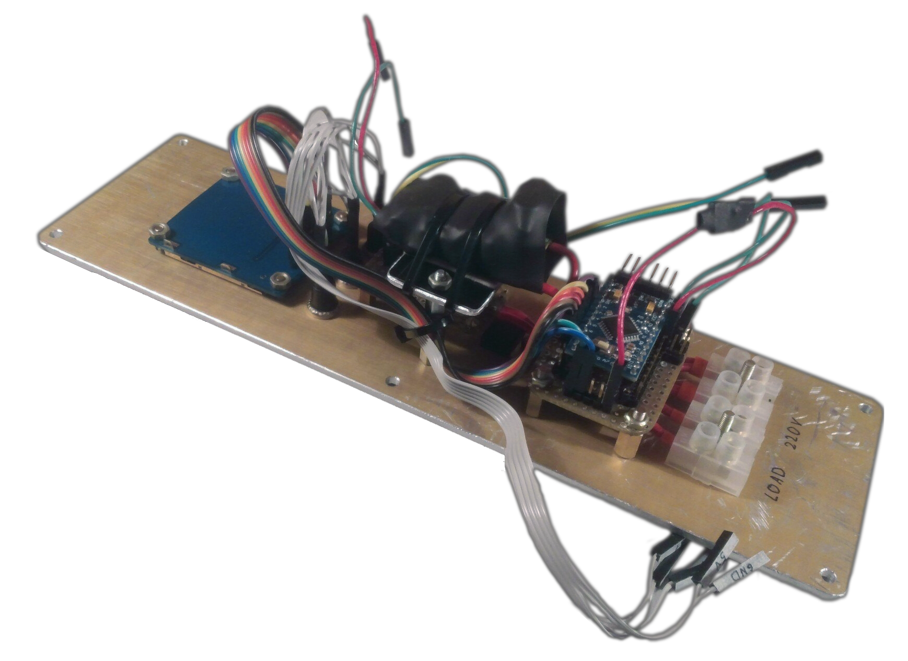
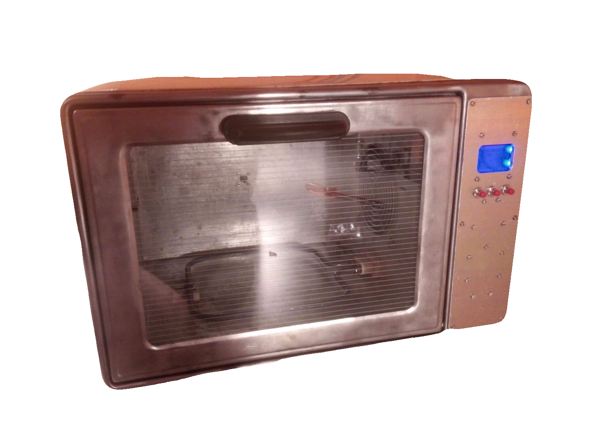

## Reflow Oven Power Regulator

This project provides some information about an Arduino-based reflow oven. A thermocouple is utilized for temperature measurement, and a PID regulator is employed for control.

The power section fragment of the electrical schematic is displayed below:

Here are the front and back views of the power regulator:

Lastly, here is an image of the fully assembled reflow oven:

